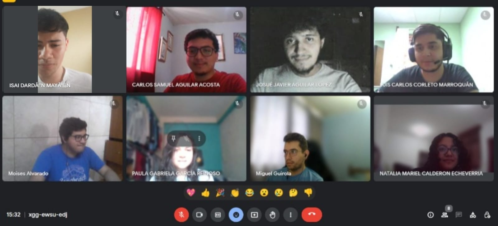
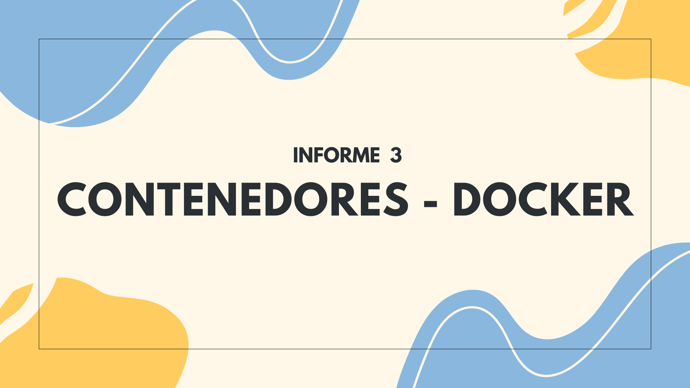

# Informe 3 | Docker-Contenedores
## Grupo 3 - Prácticas Iniciales - Sección F-

Integrantes                     | Carnet
--------------------------------|------------
Natalia Calderon Echeverria | 202200007 
Luis Calros Corleto Marroquín | 202106651
Carlos Samuel Aguilar Acosta| 202200131
Isai Dardón Mayén | 202200033
Moises Ivan D. Alvarado García | 202002907
Josue Javier Aguilar Lopez| 201909035
                                                      
                    
Tutores | Carnet 
---------|--------------
Miguel Fernando Guirola Villalta | 201700772
Paula Gabriela García Reinoso | 201700823

## Foto de los integrantes 

# Contenido

Documentos
    <ul>
       <li><a href="https://github.com/USAC-LuisCorleto/20252S_Informe3_Docker-Contenedores/blob/main/MANUAL%20DE%20USUARIO.pdf" target="_blank">:arrow_right: Manual</a></li>
    </ul>
    
## Video 

